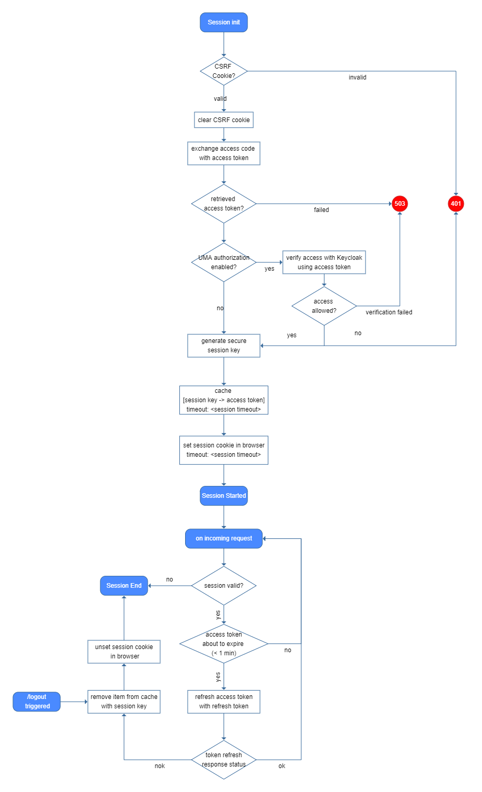

# What is Klarrio/traefik-forward-auth ?

A fork of https://github.com/geek-cookbook/traefik-forward-auth, which is in turn a fork of https://github.com/noelcatt/traefik-forward-auth, which is in turn a fork of @thomseddon's traefik-forward-auth.

Some history:  

1. @thomseddon's version supports only Google OIDC
2. @noelcatt's version supports any OIDC, but doesn't have a docker image build pipeline setup.
3. funkypenguin's version has a docker image build pipeline

Klarrio's fork adds the following (among other tweaks):  

- Automatic refresh of access tokens using the refresh token
- validation of the access token with the OIDC server, using the token introspection endpoint
- Addition of an "info" cookie, which is set along with the authentication cookie (HttpOnly on), that is accessible from Javascript (HttpOnly off). It contains the session timeout and the user's name.
- [UMA](https://docs.kantarainitiative.org/uma/wg/oauth-uma-grant-2.0-05.html) based authorization

These additions have been primarily tested with a Keycloak IAM server, so your mileage may vary with other OIDC servers.


# Traefik Forward Auth [](https://travis-ci.org/funkypenguin/traefik-forward-auth) [](https://goreportcard.com/badge/github.com/funkypenguin/traefik-forward-auth)

A forward authentication service that provides OAuth based login and authentication for the Traefik reverse proxy.


## Why?

- Seamlessly overlays any http service with a single endpoint (see: `-url-path` in [Configuration](#configuration))
- Supports multiple domains/subdomains by dynamically generating redirect_uri's
- Allows authentication to persist across multiple domains (see [Cookie Domains](#cookie-domains))
- Supports extended authentication beyond Google token lifetime (see: `-lifetime` in [Configuration](#configuration))

## Quick Start

See the (examples) directory for example docker compose and traefik configuration files that demonstrates the forward authentication configuration for traefik and passing required configuration values to traefik-forward-auth.

## Configuration

The following configuration is supported:


|Flag                   |Type  |Description|
|-----------------------|------|-----------|
|-client-id|string|*Google Client ID (required)|
|-client-secret|string|*Google Client Secret (required)|
|-secret|string|*Secret used for signing (required)|
|-oidcIssuer|string|*OIDC Issuer URL (required)|
|-config|string|Path to config file|
|-auth-host|string|Central auth login (see below)|
|-cookie-domains|string|Comma separated list of cookie domains (see below)|
|-cookie-name|string|Authentication Cookie Name (default "_forward_auth")|
|-info-cookie-name|string|Info Cookie Name (default "_forward_auth_info")|
|-cookie-secure|bool|Use secure cookies (default true)|
|-csrf-cookie-name|string|CSRF Cookie Name (default "_forward_auth_csrf")|
|-insecure-certificates|bool|Allow insecure certificates (default false)|
|-domain|string|Comma separated list of email domains to allow|
|-whitelist|string|Comma separated list of email addresses to allow|
|-lifetime|int|Session length in seconds (default 43200)|
|-url-path|string|Callback URL (default "_oauth")|
|-prompt|string|Space separated list of [OpenID prompt options](https://developers.google.com/identity/protocols/OpenIDConnect#prompt)|
|-uma_authorization|bool|whether [UMA](https://docs.kantarainitiative.org/uma/wg/oauth-uma-grant-2.0-05.html)-based authorization will be performed (default false)|
|-token-validator-enabled|bool|whether to validate the access token with the openid server on every request (default true)|
|-token-min-validity-seconds|int|when the access token's validity will expire within this period, it will be refreshed using the refresh token (default 10)|
|-access-token-roles-field|string|Field name within the OIDC access token which contains the roles|
|-access-token-roles-delimiter|string|which delimiter is being used in the OIDC access token to define multiple roles|
|-log-level|string|Log level: trace, debug, info, warn, error, fatal, panic (default "warn")|
|-log-format|string|Log format: text, json, pretty (default "text")|

Configuration can also be supplied as environment variables (use upper case and swap `-`'s for `_`'s e.g. `-client-id` becomes `CLIENT_ID`)

Configuration can also be supplied via a file, you can specify the location with `-config` flag, the format is `flag value` one per line, e.g. `client-id your-client-id`)

## OAuth Configuration

Head to https://console.developers.google.com & make sure you've switched to the correct email account.

Create a new project then search for and select "Credentials" in the search bar. Fill out the "OAuth Consent Screen" tab.

Click, "Create Credentials" > "OAuth client ID". Select "Web Application", fill in the name of your app, skip "Authorized JavaScript origins" and fill "Authorized redirect URIs" with all the domains you will allow authentication from, appended with the `url-path` (e.g. https://app.test.com/_oauth)

## Usage

The user's access token is set in the `X-Forwarded-Access-Token` header, to pass this on add this to the `authResponseHeaders` as shown [here](https://github.com/thomseddon/traefik-forward-auth/blob/master/example/docker-compose-dev.yml).

## User Restriction

You can restrict who can login with the following parameters:

* `-domain` - Use this to limit logins to a specific domain, e.g. test.com only
* `-whitelist` - Use this to only allow specific users to login e.g. thom@test.com only

Note, if you pass `whitelist` then only this is checked and `domain` is effectively ignored.

## Cookie Domains

You can supply a comma separated list of cookie domains, if the host of the original request is a subdomain of any given cookie domain, the authentication cookie will set with the given domain.

For example, if cookie domain is `test.com` and a request comes in on `app1.test.com`, the cookie will be set for the whole `test.com` domain. As such, if another request is forwarded for authentication from `app2.test.com`, the original cookie will be sent and so the request will be allowed without further authentication.

Beware however, if using cookie domains whilst running multiple instances of traefik/traefik-forward-auth for the same domain, the cookies will clash. You can fix this by using the same `cookie-secret` in both instances, or using a different `cookie-name` on each.

## Per-Request Role Restriction
You can limit access to requests based on one or more roles being present in the session's access token.  

To define which roles are required to access a certain request, add the `X-Forward-Auth-Accepted-Roles` header to the request, with the comma-separated list of roles as its value.  
If you want to do this per service, you can simply add the following label to your service's configuration (ex: docker-compose format), which Traefik will then pick up and it will add 
the custom header to each request going to the traefik-forward-auth service:
```
traefik.frontend.headers.customRequestHeaders=X-Forward-Auth-Accepted-Roles:my-role-A,my-role-B
```

When the traefik-forward-auth service notices the `X-Forward-Auth-Accepted-Roles` header in an incoming request, it will verify whether *one of the* accepted roles is present in  the session's access token. Only when present it will allow the request, otherwise it will respond with a `401 Unauthorized".  
Roles are not one of the standard claims within an OAuth access token, but traefik-forward-auth needs a way to figure out which roles are present in the access token. For this it uses the `access-token-roles-field` and `access-token-roles-delimiter` flags, which indicate how these roles can be parsed from the access token's claims.

## Automatic access token refresh
On every request, the access token for the active session is verified for expiry. If it is about to expire, it will be automatically refreshed with a call to the 
openid token endpoint (`grant_type` with value `refresh_token`), using the refresh token that was previously acquired. The session is destroyed when the access token refresh fails.  
You can configure the minimum token validity with the `token-min-validity-seconds` configuration property.

## Session
When a user has successfully authenticated with the OIDC server, the forward-auth server starts a session.  
It places two cookies (name customizable):  

- Authentication cookie: This cookie is used by the traefik-forward-auth server to verify the session. It is placed with the `HttpOnly` setting, meaning that it can't be accessed from Javascript.
- Info cookie: this cookie is placed purely for informative reasons towards the application, for the duration of the session. It contains the session expiration time and the name of the user. This cookie 
  can be accessed from Javascript, for example to verify whether the session is still active.



## Operation Modes

#### Overlay

Overlay is the default operation mode, in this mode the authorisation endpoint is overlayed onto any domain. By default the `/_oauth` path is used, this can be customised using the `-url-path` option.

If a request comes in for `www.myapp.com/home` then the user will be redirected to the google login, following this they will be sent back to `www.myapp.com/_oauth`, where their token will be validated (this request will not be forwarded to your application). Following successful authoristion, the user will return to their originally requested url of `www.myapp.com/home`.

As the hostname in the `redirect_uri` is dynamically generated based on the orignal request, every hostname must be permitted in the Google OAuth console (e.g. `www.myappp.com` would need to be added in the above example)

#### Auth Host

This is an optional mode of operation that is useful when dealing with a large number of subdomains, it is activated by using the `-auth-host` config option (see [this example docker-compose.yml](https://github.com/thomseddon/traefik-forward-auth/blob/master/example/docker-compose-auth-host.yml)).

For example, if you have a few applications: `app1.test.com`, `app2.test.com`, `appN.test.com`, adding every domain to Google's console can become laborious.
To utilise an auth host, permit domain level cookies by setting the cookie domain to `test.com` then set the `auth-host` to: `auth.test.com`.

The user flow will then be:

1. Request to `app10.test.com/home/page`
2. User redirected to Google login
3. After Google login, user is redirected to `auth.test.com/_oauth`
4. Token, user and CSRF cookie is validated, auth cookie is set to `test.com`
5. User is redirected to `app10.test.com/home/page`
6. Request is allowed

With this setup, only `auth.test.com` must be permitted in the Google console.

Two criteria must be met for an `auth-host` to be used:

1. Request matches given `cookie-domain`
2. `auth-host` is also subdomain of same `cookie-domain`

## Copyright

2018 Thom Seddon
2020 Klarrio

## License

[MIT](LICENSE.md)
